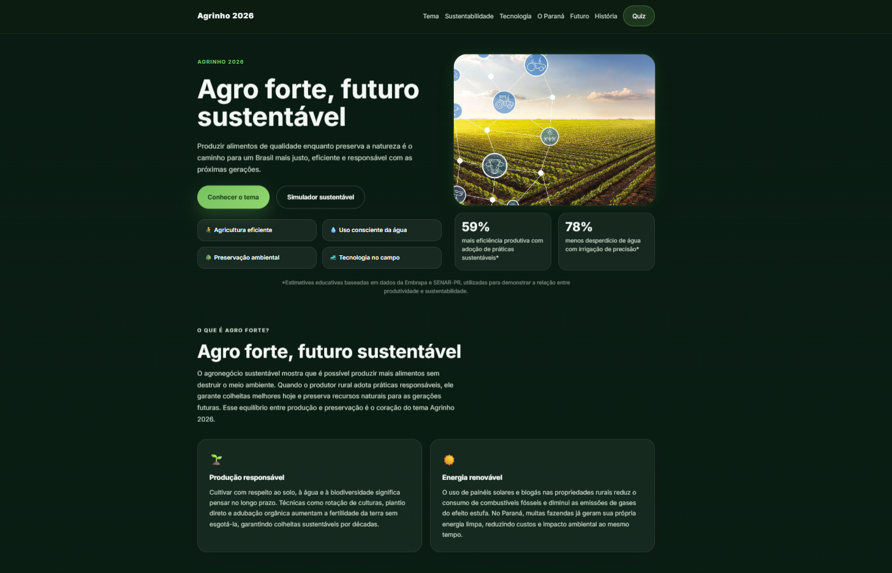
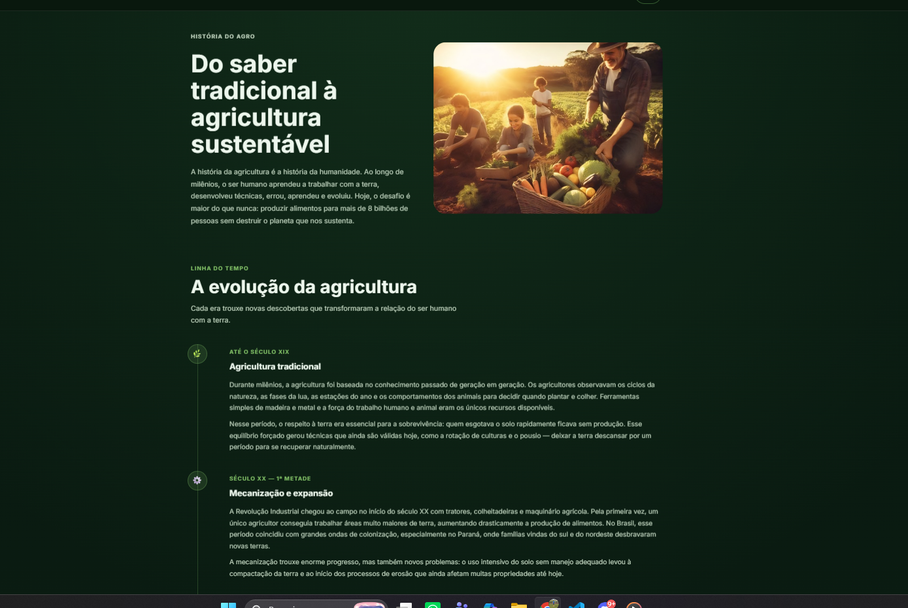
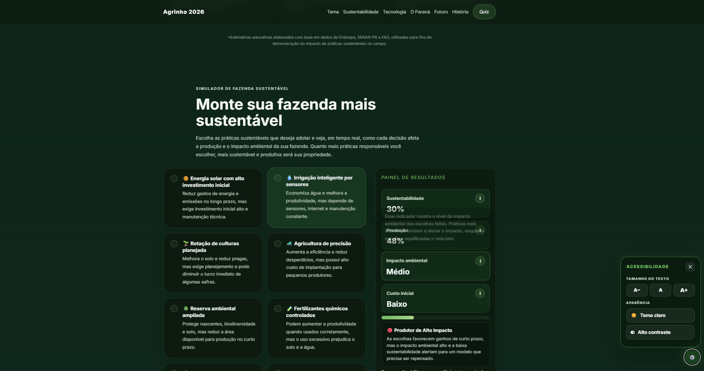
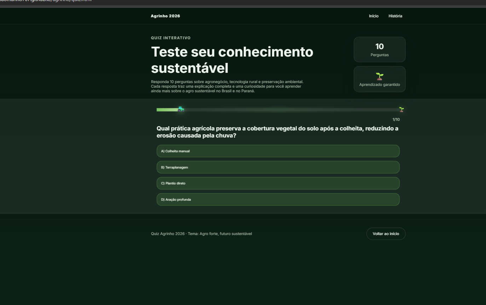

# 🌱 Agro Forte, Futuro Sustentável

## Concurso Agrinho 2026 – Programação Front-End

> **Tema Oficial:** Agro forte, futuro sustentável: equilíbrio entre produção e meio ambiente.

---

## 🌐 Acesse o Projeto

### Site Publicado

🔗 https://joaomarino767.github.io/agrinho/

### Repositório

🔗 https://github.com/joaomarino767/agrinho

---

# 📖 Sobre o Projeto

O projeto **Agro Forte, Futuro Sustentável** foi desenvolvido para o Concurso Agrinho 2026 com o objetivo de demonstrar como a tecnologia pode contribuir para uma produção agrícola mais eficiente, sustentável e responsável.

A plataforma apresenta conteúdos educativos, experiências interativas e recursos visuais modernos que ajudam o usuário a compreender a importância do equilíbrio entre produtividade, inovação tecnológica e preservação ambiental.

Além de informar, o projeto busca conscientizar sobre o papel da agricultura sustentável na construção de um futuro melhor para as próximas gerações.

---

# 📸 Capturas de Tela

## 🏠 Página Inicial

A página inicial apresenta o tema do projeto, destacando a relação entre tecnologia, sustentabilidade e produção agrícola.



---

## 📖 História da Agricultura

A seção histórica mostra a evolução da agricultura ao longo dos séculos, desde os métodos tradicionais até a agricultura sustentável moderna.



---

## 🚜 Simulador de Fazenda Sustentável

O simulador permite que o usuário tome decisões relacionadas à gestão de uma propriedade rural, observando em tempo real seus impactos na produtividade, sustentabilidade e meio ambiente.



---

## 🧠 Quiz Educativo

O quiz interativo apresenta perguntas sobre sustentabilidade, agronegócio, tecnologia rural e preservação ambiental, tornando o aprendizado mais dinâmico.



---

# 🎯 Objetivos do Projeto

* Promover a educação ambiental;
* Demonstrar a importância da sustentabilidade no agronegócio;
* Valorizar a aplicação da tecnologia no campo;
* Incentivar práticas agrícolas responsáveis;
* Relacionar produtividade e preservação ambiental;
* Apresentar soluções sustentáveis para o futuro da agricultura.

---

# 🌾 O Paraná e o Agronegócio

O Paraná é um dos estados mais importantes para a agricultura brasileira, sendo referência nacional na produção de alimentos e na adoção de tecnologias agrícolas.

O projeto destaca a contribuição do estado para o desenvolvimento sustentável do agronegócio, mostrando como inovação e preservação ambiental podem caminhar juntas.

---

# 🚜 Simulador de Fazenda Sustentável

Uma das principais funcionalidades do projeto é o simulador interativo.

O usuário pode selecionar diferentes práticas agrícolas e visualizar como suas escolhas influenciam:

* Sustentabilidade;
* Produção;
* Impacto ambiental;
* Custos;
* Resultado final da propriedade.

O objetivo é demonstrar que as melhores decisões são aquelas que equilibram produtividade e responsabilidade ambiental.

---

# 🧠 Quiz Educativo

O sistema de quiz foi desenvolvido para reforçar o aprendizado de forma interativa.

Recursos implementados:

* 10 perguntas educativas;
* Barra de progresso dinâmica;
* Trator acompanhando a evolução do usuário;
* Sistema de pontuação;
* Explicações após as respostas;
* Mensagens personalizadas de desempenho;
* Animações visuais;
* Reinício rápido do quiz.

---

# ♿ Recursos de Acessibilidade

Pensando na inclusão e no conforto dos usuários, foram implementados recursos de acessibilidade:

* Tema claro;
* Tema escuro;
* Controle de tamanho do texto;
* Alto contraste;
* Estrutura semântica;
* Navegação intuitiva;
* Compatibilidade com diferentes dispositivos.

---

# 📱 Responsividade

O projeto foi desenvolvido para funcionar corretamente em diferentes tamanhos de tela:

* Smartphones;
* Tablets;
* Notebooks;
* Computadores Desktop.

Foram utilizadas técnicas modernas de responsividade para garantir uma experiência consistente em qualquer dispositivo.

---

# 💻 Tecnologias Utilizadas

## HTML5

* Estrutura semântica;
* Organização do conteúdo;
* Acessibilidade.

## CSS3

* Flexbox;
* Grid Layout;
* Responsividade;
* Variáveis CSS;
* Animações e transições.

## JavaScript (Vanilla JS)

* Manipulação do DOM;
* Interatividade;
* Simulador sustentável;
* Quiz educativo;
* Recursos de acessibilidade;
* Atualização dinâmica da interface.

---

# ✅ Conformidade com o Regulamento

O projeto foi desenvolvido utilizando exclusivamente tecnologias Front-End nativas:

✔ HTML5

✔ CSS3

✔ JavaScript

✔ Responsividade

✔ Estrutura semântica

✔ Acessibilidade

✔ Sem frameworks

✔ Sem bibliotecas externas

✔ Sem Bootstrap

✔ Sem React

✔ Sem Vue

✔ Sem Tailwind

---

# 📂 Estrutura do Projeto

```text
/
├── index.html
├── historia.html
├── quiz.html
├── script.js
├── questions.js
├── style.css
├── README.md
│
├── assets/
│   ├── imagens
│   ├── icones
│   ├── readme
│   │   ├── home.png
│   │   ├── historia.png
│   │   ├── simulador.png
│   │   └── quiz.png
│   └── demais recursos visuais
```

---

# 🌿 Sustentabilidade

O projeto aborda práticas fundamentais para a construção de um futuro sustentável:

* Conservação do solo;
* Uso racional da água;
* Agricultura de precisão;
* Energia renovável;
* Rotação de culturas;
* Preservação de nascentes;
* Redução de impactos ambientais.

A proposta demonstra que tecnologia e sustentabilidade podem atuar juntas para fortalecer o agronegócio brasileiro.

---

# 🤖 Transparência sobre o Uso de Inteligência Artificial

Este projeto foi desenvolvido por **João Lucas da Silva Marino**.

Ferramentas de Inteligência Artificial foram utilizadas como apoio educacional durante o desenvolvimento, auxiliando em:

* Revisão de código;
* Correção de erros;
* Sugestões de design;
* Melhorias de acessibilidade;
* Organização da documentação;
* Apoio ao aprendizado de programação.

Todas as decisões do projeto, personalizações, adaptações, testes e validações finais foram realizadas pelo autor.

O uso dessas ferramentas teve caráter exclusivamente educacional e de apoio ao aprendizado.

---

# 👨‍🎓 Autor

**João Lucas da Silva Marino**

Estudante do Ensino Médio

Concurso Agrinho 2026

Categoria Programação Front-End

Paraná – Brasil

---

# 🌱 Considerações Finais

O projeto **Agro Forte, Futuro Sustentável** busca demonstrar que a tecnologia pode ser utilizada como ferramenta de conscientização, educação e transformação social.

Por meio da programação, da interatividade e do conteúdo educativo, a plataforma incentiva a reflexão sobre a importância do equilíbrio entre produção agrícola e preservação ambiental.

> **Agro forte, futuro sustentável: equilíbrio entre produção e meio ambiente.**
